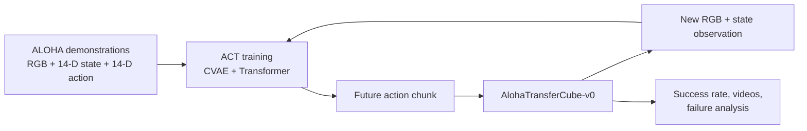
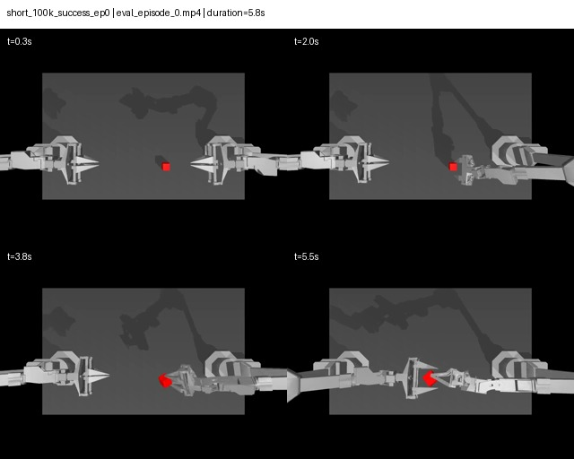

# ACT Robot Learning: Closed-Loop Visual Imitation in Simulation

An end-to-end, reproducible embodied-learning project built with
[LeRobot](https://github.com/huggingface/lerobot) and ACT (Action Chunking
with Transformers). The project trains a visual behavior-cloning policy for
ALOHA simulated transfer-cube manipulation, evaluates it in closed loop, and
tests how action-chunk configuration changes task success.

**Original baseline:** 70.0% success (35/50 closed-loop episodes)<br>
**Three-seed comparison:** baseline 72.67% +/- 10.26 vs short 76.00% +/- 8.72

## Project overview

The objective was not merely to run an official demo. This repository makes
the full robotics-learning loop inspectable: dataset schema, policy data flow,
GPU training, simulation rollout, quantitative evaluation, an ablation, and
failure cases drawn from actual rollout videos.



## Benchmark and data

- **Dataset:** `lerobot/aloha_sim_transfer_cube_human`
- **Pinned revision:** `6a43d500f101255823a9d2b9dc244eeb01a2cd31`
- **Task:** `AlohaTransferCube-v0` at 50 Hz
- **Demonstrations:** 50 episodes / 20,000 frames
- **Observation:** one top RGB camera plus 14-D dual-arm proprioceptive state
- **Action:** 14-D dual-arm joint action

Dataset fields, physical dimensions, statistics, and an episode visualization
are documented in [docs/01_dataset.md](docs/01_dataset.md). The visualizer and
schema inspector are in [scripts/visualize_episode.py](scripts/visualize_episode.py)
and [scripts/inspect_dataset.py](scripts/inspect_dataset.py).

## ACT data flow

At training time, the current RGB image and robot state condition ACT; the
ground-truth future action sequence supervises a predicted action chunk. At
inference time there is no future ground truth: the environment applies selected
actions, returns a fresh observation, and the policy replans.

```text
top RGB -> ResNet-18 visual encoder -> visual tokens --+
                                                      +-> ACT Transformer -> future 14-D action chunk
14-D robot state ------------------------------------+
```

The implementation uses LeRobot 0.6.0 ACT with ResNet-18, a CVAE latent size
of 32, one observation step, no temporal ensembling, and EGL headless MuJoCo
rendering. [docs/02_act_architecture.md](docs/02_act_architecture.md) traces
the current source-level preprocessing, model, loss, `select_action`, and
action-chunk execution path.

## Environment and reproducibility

| Item | Value |
| --- | --- |
| Local development | Windows + WSL2 Ubuntu 22.04, CPU-only smoke tests |
| Training/evaluation | Ubuntu 24.04 container, 1× RTX 4090 (24 GB) |
| Python | 3.12.13 |
| LeRobot | 0.6.0 |
| PyTorch | 2.11.0+cu130 |
| MuJoCo | 3.8.1, EGL headless renderer |
| Seed | 1000 |
| Dataset storage | cloud persistent shared volume |

Full commands, cache locations, environment records, and known cloud
constraints are in [docs/00_environment.md](docs/00_environment.md) and
[environment/system_info.md](environment/system_info.md). Large checkpoints,
datasets, and MP4s are intentionally excluded from Git and retained in cloud
shared storage.

## Training

Run these commands on a Linux GPU machine after following the environment
notes. The configurations fix dataset revision, seed, batch size (8), training
steps (100k), and 50-episode evaluation protocol.

```bash
# ACT baseline: chunk_size=100, n_action_steps=100
bash scripts/train_baseline.sh

# Action-chunk configurations
bash scripts/train_chunk_ablation.sh short  # (50, 50)
bash scripts/train_chunk_ablation.sh long   # (150, 150)
```

`scripts/train_baseline.sh` sets persistent Hugging Face/Torch caches, uses
the headless EGL renderer, and handles a LeRobot 0.6.0 resume-specific CLI
detail. See [docs/03_training.md](docs/03_training.md).

## Closed-loop evaluation

At each milestone, LeRobot runs 50 fresh simulation rollouts, up to 400 steps
per episode. This is the metric used for claims—not training loss.

| baseline checkpoint | success rate | average return |
| ---: | ---: | ---: |
| 40k | 64.0% | 187.42 |
| 60k | 60.0% | 168.40 |
| 80k | 58.0% | 179.56 |
| 100k | **70.0%** | **194.18** |

The 20k baseline checkpoint was preserved, but its evaluation was interrupted
before EGL was configured; it is explicitly marked missing rather than counted
as failure. [docs/04_rollout.md](docs/04_rollout.md) explains the rollout
loop and documents all evaluation artifacts.

## Action-chunk ablation

The experiment jointly varies the prediction horizon and execution/replanning
interval while holding dataset, architecture, seed, batch size, steps, and
evaluation protocol fixed.

| configuration | chunk size | actions before replan | final success |
| --- | ---: | ---: | ---: |
| short | 50 | 50 (1.0 s) | **86.0% (43/50), seed 1000** |
| baseline | 100 | 100 (2.0 s) | 70.0% (35/50) |
| long | 150 | 150 (3.0 s) | 82.0% (41/50) |

The three-seed confirmation repeats baseline and short: short averages 76.00%
versus 72.67% for baseline, but the observed seed-to-seed variance overlaps.
Thus short is promising evidence, not a claim of statistical superiority. See
[docs/05_experiments.md](docs/05_experiments.md),
[results/tables/chunk_ablation_metrics.csv](results/tables/chunk_ablation_metrics.csv),
and [results/tables/multiseed_summary.csv](results/tables/multiseed_summary.csv).

## Demo

Short `(50,50)`, final 100k checkpoint, successful rollout. Four sampled
frames show approach, grasp/transfer, and final left-side placement.



Original MP4 rollout videos are retained outside Git on persistent cloud
storage. `scripts/make_rollout_contact_sheet.py` converts selected MP4s into
small, versioned review figures without GPU use.

## Failure analysis

The repository indexes 56 recorded rollout videos using LeRobot's per-episode
success labels; 20 are failures. Six annotated cases cover failed approach,
unstable handoff, partial transport, and missed final placement. The analysis
separates visual observation from mechanism hypotheses and includes the
underlying contact sheets.

See [docs/06_failure_analysis.md](docs/06_failure_analysis.md) and
[results/tables/recorded_rollouts.csv](results/tables/recorded_rollouts.csv).

## Key engineering takeaways

- Robot imitation learning supervises **future action sequences**, not an
  image class label; actions change the next observation distribution.
- Low behavior-cloning loss does not guarantee manipulation success. Closed-
  loop success rate and videos expose errors that loss alone cannot.
- `chunk_size` controls the predicted future horizon; `n_action_steps`
  determines when the controller gets a new chance to correct using feedback.
- Cloud reproducibility requires persistent storage, version pinning, logs,
  checkpoints, video evidence, and explicit headless rendering configuration.
- A one-seed ablation is useful engineering evidence, but uncertainty should
  be addressed with repeated seeds before making a broad research claim.

## Repository layout

```text
configs/       frozen baseline and ablation configurations
docs/          environment, dataset, ACT, training, rollout, experiments, failures
scripts/       inspection, visualization, training, result/video indexing tools
results/       committed tables and lightweight contact sheets
environment/   pinned Python packages and system record
```

## Next improvements

1. Repeat baseline/short/long with additional seeds to measure variance.
2. Add a state-only or camera-modality ablation if implemented without changing
   the evaluation protocol.
3. Evaluate the final policies on 100 episodes and inspect sensitivity to
   initial object placement.
