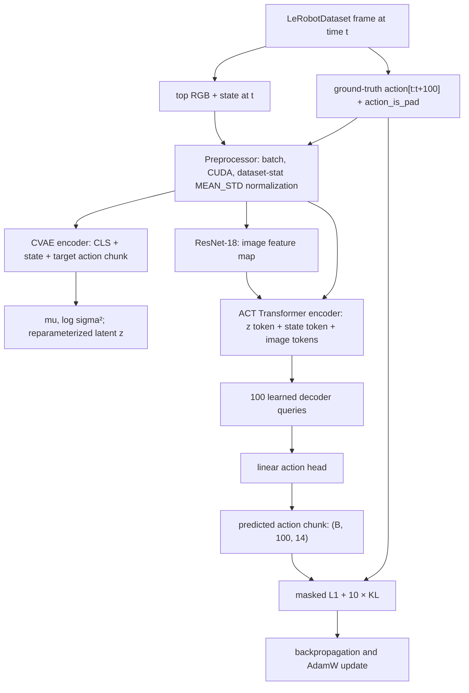
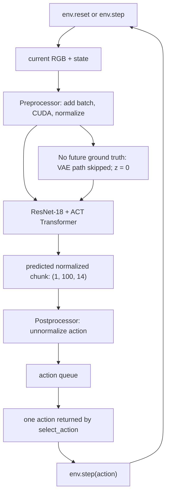

# ACT architecture and data flow

This document describes the **installed LeRobot 0.6.0 implementation**, not a generic recollection of the ACT paper.

## Source map

| Responsibility | LeRobot 0.6.0 source |
| --- | --- |
| Configuration and validation | `lerobot/policies/act/configuration_act.py` |
| Pre/post-processing | `lerobot/policies/act/processor_act.py` |
| Policy wrapper, loss, queue, temporal ensemble | `lerobot/policies/act/modeling_act.py` (`ACTPolicy`) |
| CVAE and Transformer network | `lerobot/policies/act/modeling_act.py` (`ACT`) |
| Future-action windows | `lerobot/datasets/factory.py`, `dataset_reader.py` |

## ALOHA baseline configuration inspected

Official model configuration: `lerobot/act_aloha_sim_transfer_cube_human`.

| Setting | Value |
| --- | --- |
| Image input | `observation.images.top`: `(3, 480, 640)` |
| Proprioception | `observation.state`: `(14,)` |
| Action output | `action`: `(14,)` |
| `n_obs_steps` | 1 |
| `chunk_size` | 100 actions |
| `n_action_steps` | 100 actions |
| Vision backbone | ImageNet-initialized ResNet-18 |
| Transformer | 512 hidden dim, 8 heads, 4 encoder layers, 1 decoder layer |
| CVAE | enabled; latent dimension 32; 4 VAE-encoder layers |
| Temporal ensemble | disabled (`null`) |
| Normalization | `MEAN_STD` for visual, state, and action |
| Loss | masked L1 + `10.0 × KL` |

At the dataset's 50 Hz, a chunk of 100 actions spans 2.0 seconds. These are the official checkpoint settings, not yet a claim that they are optimal for this project.

Although many imitation-learning descriptions allow an observation history, this LeRobot 0.6.0 ACT implementation validates `n_obs_steps == 1`. Thus this baseline consumes the **current** RGB/state observation and predicts a future action sequence; it does not stack multiple past observations.

## How a future action chunk enters a training batch

`ACTConfig.action_delta_indices` returns `range(chunk_size)`. The dataset factory converts those indices to timestamps using the dataset FPS. For this benchmark and `chunk_size=100`, a frame at time `t` has the target sequence:

```text
action[t + 0], action[t + 1], ..., action[t + 99]
```

At 50 Hz these are offsets 0.00 s through 1.98 s. At the tail of an episode, LeRobot clamps an out-of-range query to the final valid frame and emits `action_is_pad=True` for those positions. ACT uses that mask in both the VAE encoder and L1 loss, so padded targets do not contribute to the objective.

## Training flow



The visual backbone returns a feature map. A 1×1 convolution projects its channels to the Transformer hidden size, and each spatial location becomes an image token. The 14-D robot state is projected by a linear layer into one state token. Therefore ACT combines visual scene information with proprioceptive configuration before predicting actions.

The training VAE encoder may see the correct future action chunk; that is permitted because it is part of the supervised target. It produces `mu` and `log(sigma²)`, samples `z` through the reparameterization trick, and is regularized toward a unit Gaussian through KL divergence.

## Inference and closed-loop rollout flow



There is no ground-truth future action at rollout time, so the VAE encoder is not run. With `use_vae=True`, the installed model sets the latent vector to zeros in inference. The policy still predicts a complete future chunk conditioned on the current observation.

`ACTPolicy.select_action()` is called once per environment step, but it does **not** necessarily run a neural-network forward pass every time. Without temporal ensembling, it fills a FIFO action queue only when empty:

1. `predict_action_chunk()` creates 100 predicted actions.
2. The first `n_action_steps` are put in the queue.
3. Each following `select_action()` pops one action and calls `env.step(action)`.
4. Once the queue is empty, the policy observes the then-current robot state/image and replans.

For the official baseline, `n_action_steps=100`, so it executes all 100 predicted actions before replanning. This is chunked execution with a 2-second replan interval, not a forward pass every control timestep.

## Chunk size, action steps, replanning, and temporal ensemble

| Parameter | Actual implementation effect |
| --- | --- |
| `chunk_size` | Number of future action queries and targets: model output has shape `(B, chunk_size, action_dim)`. It determines the training horizon. |
| `n_action_steps` | Prefix length inserted into the FIFO queue. It must be no larger than `chunk_size`; it determines how many predicted steps execute before a fresh model forward/replan. |
| `temporal_ensemble_coeff=None` | Default baseline path: FIFO queue. |
| `temporal_ensemble_coeff!=None` | A model forward happens every environment step; overlapping action predictions are exponentially combined. The config enforces `n_action_steps=1` in this mode. |

Longer execution between replans reduces inference frequency and can preserve a coherent maneuver, but it becomes more open-loop: an image/state change caused by grasp error, contact, or drift cannot be corrected until the queue is consumed. A very short `n_action_steps` replans more frequently but costs more model evaluations and may reduce long-horizon temporal consistency. Our future chunk ablation will keep this distinction explicit rather than treating `chunk_size` and `n_action_steps` as synonyms.

## Normalization and image handling

`make_act_pre_post_processors()` constructs the ACT processor pipelines:

```text
pre:  rename observations → add batch dimension → move to config.device → normalize
post: unnormalize action → move result to CPU
```

Normalization statistics come from the dataset metadata. The ALOHA dataset stores image/state/action statistics, and the official ACT config uses mean/std normalization for all three feature types. The policy receives normalized numerical values; `env.step()` receives the postprocessed, unnormalized 14-D action.

The training dataset factory requests image frames as uint8, while the processor normalizes them using the stored visual statistics. The standalone inspection script deliberately uses LeRobot's default reader behavior, which returns a decoded float image; this is why its printed sample dtype differs from a training-loader batch.
