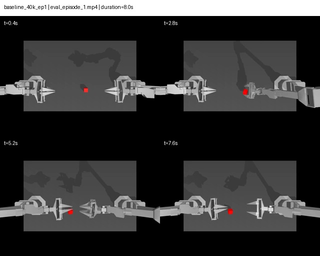
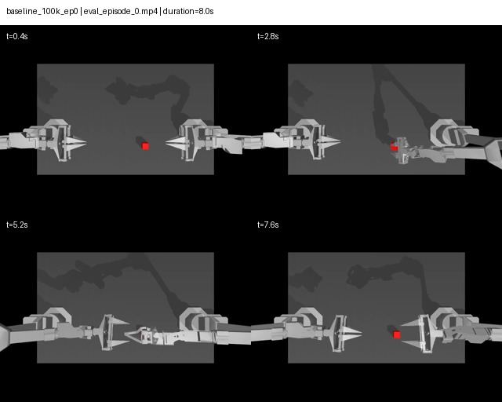
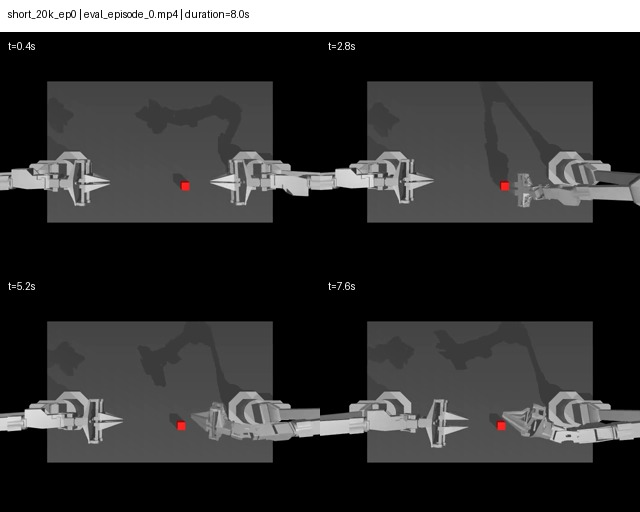
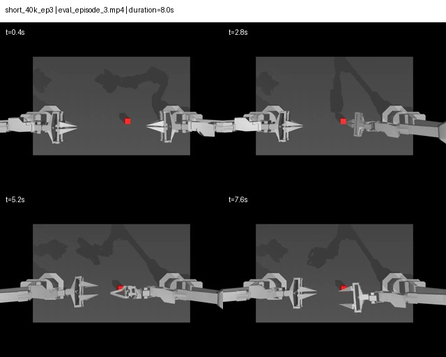
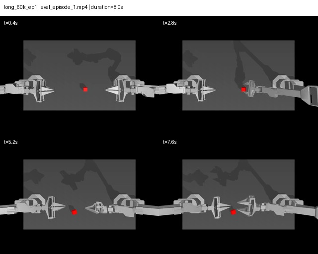
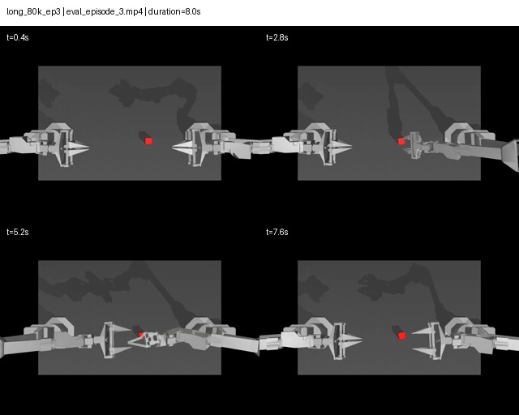

# Failure analysis

## Protocol

Failure analysis uses recorded closed-loop rollout videos, not training loss
alone. Each selected case must identify its configuration, checkpoint,
episode, success label, visible behavior, and the most plausible mechanism.
The analysis distinguishes observed facts from hypotheses.

The video index is generated from LeRobot's per-episode evaluation records by
`scripts/index_recorded_rollouts.py`. This avoids visually guessing whether a
video succeeded.

## Candidate case selection

Select 5--10 videos labelled `success=false` across the baseline, short, and
long conditions. Prefer a mixture of:

- failure before contact (object localization or approach);
- unstable or mistimed grasp;
- post-grasp drop or trajectory drift;
- late-stage placement error;
- long open-loop execution without timely correction.

## Case template

| case | configuration | checkpoint | episode | observed behavior | evidence | hypothesis |
| --- | --- | ---: | ---: | --- | --- |
| F1 | baseline `(100,100)` | 40k | 1 | Both arms approach the cube, but it remains on the workspace at the end; no completed transfer is visible. | `success=false`, return 0; contact sheet below | approach/grasp did not establish a stable handoff state |
| F2 | baseline `(100,100)` | 100k | 0 | The right arm approaches, but the cube remains in the right/central workspace rather than reaching the target placement. | `success=false`, return 58 | incomplete grasp or transport before handoff |
| F3 | short `(50,50)` | 20k | 0 | Early policy motion approaches the cube, yet the cube remains untransferred throughout the sampled sequence. | `success=false`, return 0 | immature visual approach or grasp timing at early training |
| F4 | short `(50,50)` | 40k | 3 | The cube reaches the region between arms but is still not placed by the final sampled frame. | `success=false`, return 11 | handoff/coordination timing failure rather than a pure approach failure |
| F5 | long `(150,150)` | 60k | 1 | The cube is displaced during the attempt but is not recovered or transferred by the end. | `success=false`, return 0 | trajectory drift with insufficient correction; consistent with, but does not prove, a long execution interval effect |
| F6 | long `(150,150)` | 80k | 3 | Partial transport is visible, but final placement is not achieved. | `success=false`, return 52 | post-grasp transport or placement error |

The contact sheets sample four frames per eight-second rollout. They make the
observed trajectory stages reviewable in Git; the original MP4 files remain on
shared storage for frame-by-frame inspection.

| F1: baseline, 40k, episode 1 | F2: baseline, 100k, episode 0 |
| --- | --- |
|  |  |

| F3: short, 20k, episode 0 | F4: short, 40k, episode 3 |
| --- | --- |
|  |  |

| F5: long, 60k, episode 1 | F6: long, 80k, episode 3 |
| --- | --- |
|  |  |

## Interpretation boundaries

A 50-episode success rate quantifies task completion under the fixed simulator
protocol. It does not prove robustness to unseen object positions, camera
changes, real hardware dynamics, or another random seed. The current
one-seed chunk ablation is an engineering comparison; multi-seed repetitions
are the appropriate GPU-backed follow-up if a stronger statistical claim is
needed.
